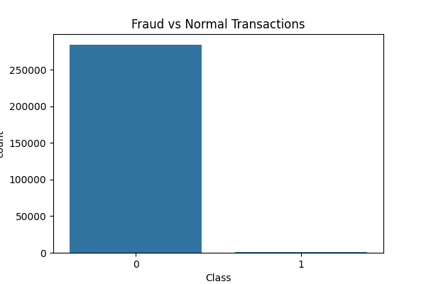
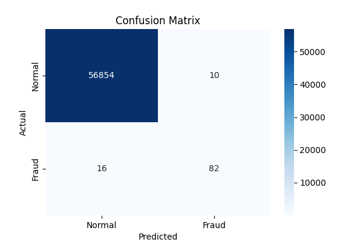

# 💳 Credit Card Fraud Detection System
 🚀 End-to-End Machine Learning Project for Real-World Fraud Detection

## 📌 Overview
This project uses Machine Learning to detect fraudulent credit card transactions.

## 🚨 Problem Statement
Fraud transactions are extremely rare (~0.17%) but cause significant financial loss. Detecting them is challenging due to class imbalance.

## 💡 Solution
- Performed EDA to understand data distribution
- Used SMOTE to handle class imbalance
- Trained Random Forest model
- Evaluated using precision, recall, and F1-score

## 🛠 Tech Stack
- Python
- Pandas, NumPy
- Scikit-learn
- SMOTE
- Matplotlib, Seaborn

## 📊 Results
- Fraud Detection Recall: **84%**
- Precision: **89%**
- Balanced model performance

## 📷 Outputs

### Class Distribution

### Correlation Heatmap

### Confusion Matrix

## 📂 Dataset

Due to GitHub file size limitations, the dataset is not included.

You can download it from Kaggle:
https://www.kaggle.com/datasets/mlg-ulb/creditcardfraud

After downloading, place the file in:

data/creditcard.csv

## 🔍 Fraud Detection Simulation

This project includes a simple simulation of a real-world fraud detection system.

### 🧠 How it Works

1. A transaction is taken from unseen test data  
2. The trained model analyzes its features  
3. The model predicts whether it is:
   - Fraud (1)
   - Normal (0)  
4. Based on prediction, an alert is triggered  

### ⚙️ Example Output
🚨 FRAUD ALERT! Transaction is suspicious.
or
✅ Normal Transaction.

### 📊 Probability-Based Prediction

The model also provides probability scores:
Fraud Probability: 0.87

This helps in understanding how confident the model is in its prediction.

### 🎯 Real-World Simulation

This simulates how banks process transactions in real-time:

Transaction → Model → Prediction → Alert System
